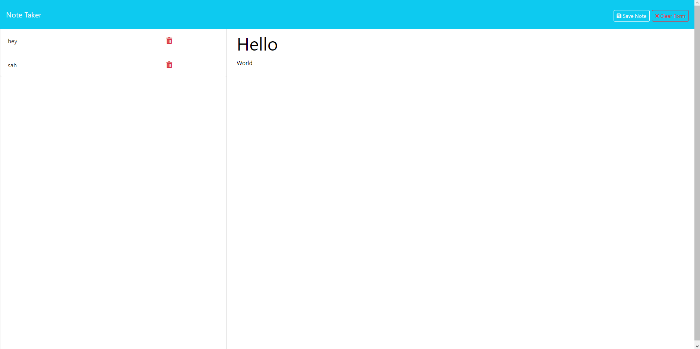

# Note Taking App

## Description
A simple note taking app! Add a title and a description for your note and have it ready when you need it. A quick and easy way to stay organized!

## Motivation
It makes sense to keep things you need in one place. When you work with a computer, that means having apps for things as simple as taking some notes in an organized way. Now I can just click a tab over and jot down a quick thought, and easily see what else is waiting for me in my day.

## Table of Contents
- [Installation](#installation)
- [Usage](#usage)
- [Credits](#credits)
- [License](#licenses)
- [Questions](#questions)

## Installation
Go to this website and try it yourself! ->  https://note-taking-app-12mu.onrender.com 

## Usage
Click the "Get Started" button when the website loads. Then you can click on the "Note Title" and "Note Text" areas to enter your information. Then, you can either save it or clear it out with the two buttons at the top right. Afterwards, you'll be able to see your notes on the left-hand column. If you click on them, they'll show up in the main note writing area. While there is a trash button, I unfortunately was not able to get my delete route to work with it. Perhaps in future development!

## Credits
https://devdocs.io/express/ - Express Documentation   https://docs.render.com/deploy-node-express-app - Deploying a website to Render

## Licenses
This project is covered by the MIT license.

## Questions 
If you have any questions or would like to reach out for any reason, please feel free!
My Email: barrettg516@gmail.com

Github: g-barrett (https://github.com/g-barrett)
